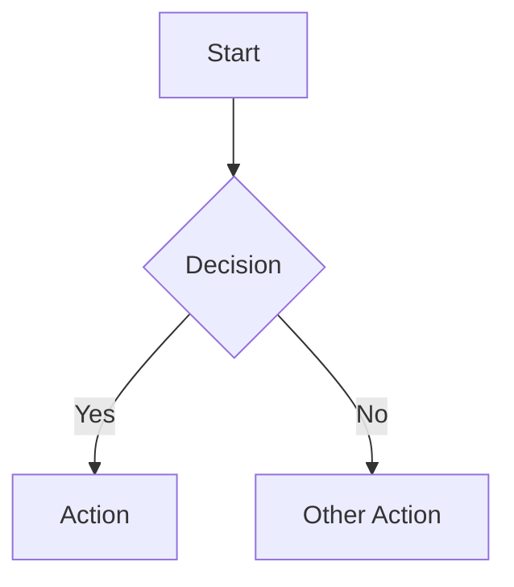
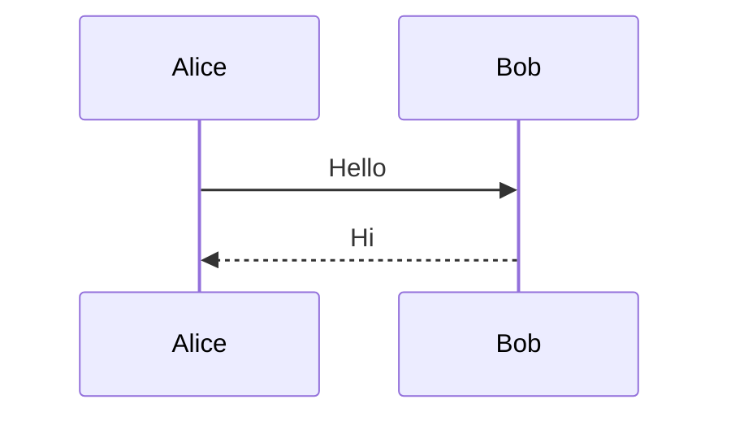
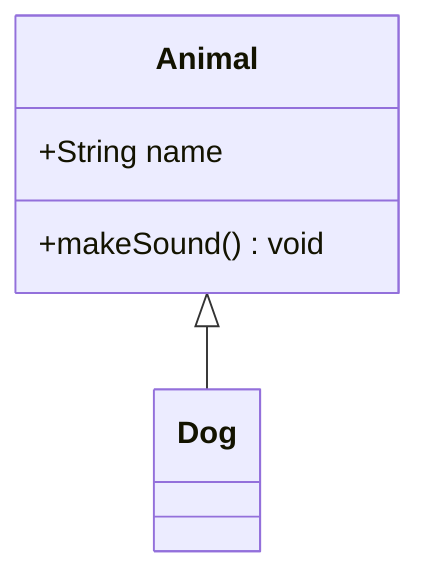
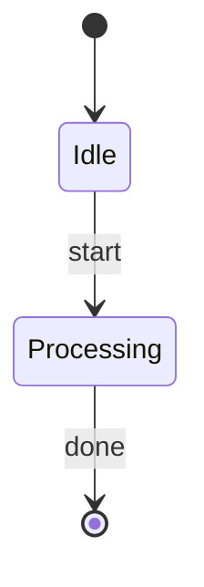
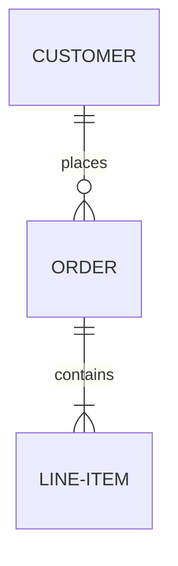

# Mermaid Diagram Validation Reference

This document details Mermaid diagram validation performed by the code-review skill.

## Important

For Mermaid validation, Claude must search the web for the latest Mermaid documentation to ensure syntax rules are current. Mermaid syntax evolves frequently, and validation must use up-to-date specifications.

**Always search:** `site:mermaid.js.org` for current syntax documentation.

## Supported Diagram Types

Validate these diagram types:

- **Flowchart** (`flowchart`, `graph`)
- **Sequence Diagram** (`sequenceDiagram`)
- **Class Diagram** (`classDiagram`)
- **State Diagram** (`stateDiagram-v2`)
- **Entity Relationship** (`erDiagram`)
- **Gantt Chart** (`gantt`)
- **Pie Chart** (`pie`)
- **Git Graph** (`gitGraph`)
- **Mindmap** (`mindmap`)
- **Timeline** (`timeline`)
- **Quadrant Chart** (`quadrantChart`)

## Common Validation Checks

### Syntax Errors (Severity: ERROR)

1. **Missing diagram type declaration**
   ```mermaid
   A --> B  <!-- Missing: flowchart TD -->
   ```

2. **Invalid node/edge syntax**
   ```mermaid
   flowchart TD
   A -> B  <!-- Should be --> or --- -->
   ```

3. **Unclosed brackets or quotes**
   ```mermaid
   flowchart TD
   A[Unclosed node
   ```

4. **Invalid characters in identifiers**

5. **Special characters in node labels causing parse errors**

   Parentheses `()` inside node labels are interpreted as Mermaid node shape syntax, causing parse errors:
   ```mermaid
   flowchart TD
   A[Local (PT) time]  <!-- ERROR: (PT) parsed as node shape -->
   ```

   **Fix options:**
   - Remove parentheses: `A[Local PT time]`
   - Use HTML entities: `A[Local &#40;PT&#41; time]`
   - Use quotes: `A["Local (PT) time"]`

   Other problematic characters in node labels:
   - `()` - Interpreted as rounded rectangle shape
   - `[]` - Interpreted as rectangle shape
   - `{}` - Interpreted as diamond/decision shape
   - `(())` - Interpreted as circle shape
   - `[[]]` - Interpreted as subroutine shape
   - `×` - Unicode multiplication sign may cause encoding issues (use `x` instead)
   - `` ` `` - Backticks can interfere with markdown parsing

6. **Greater-than/less-than symbols causing blockquote interpretation**

   When `>` or `>=` appears at the start of a node label (especially in diamond/decision nodes), markdown parsers may interpret it as a blockquote:
   ```mermaid
   flowchart TD
   A{>= COD?}  <!-- ERROR: >= interpreted as markdown blockquote -->
   B{> threshold}  <!-- ERROR: > interpreted as markdown blockquote -->
   ```

   This causes "Unsupported markdown: blockquote" errors in rendered diagrams.

   **Fix options:**
   - Use descriptive labels instead of operators: `A{"COD Filter"}`, `B{"Threshold Check"}`
   - Wrap in quotes with escaped content: `A{">= COD?"}` (may still fail in some renderers)
   - Use HTML entities: `A{&gt;= COD?}`
   - Reword to avoid leading `>`: `A{"Check: value >= COD"}`

   **Best practice:** Avoid `>`, `>=`, `<`, `<=` at the start of any node label. Use semantic descriptions instead.

7. **Newlines inside node labels**

   Raw newlines break node definitions:
   ```mermaid
   flowchart TD
   A[(Database
   Name)]  <!-- ERROR: newline breaks parsing -->
   ```

   **Fix:** Use `<br/>` for line breaks:
   ```mermaid
   flowchart TD
   A[(Database<br/>Name)]  <!-- Correct -->
   ```

### Structural Issues (Severity: WARNING)

1. **Undefined nodes referenced**
   ```mermaid
   flowchart TD
   A --> B
   C --> D  <!-- D never defined with content -->
   ```

2. **Disconnected subgraphs** - Nodes not connected to main flow

3. **Circular references without proper handling**

### Style Issues (Severity: INFO)

1. **Inconsistent naming conventions**
2. **Missing node labels**
3. **Overly complex single diagrams** (should be split)

## Diagram-Specific Rules

### Flowcharts



- Direction must be: `TB`, `TD`, `BT`, `RL`, `LR`
- Node shapes: `[]` rectangle, `()` rounded, `{}` diamond, `[[]]` subroutine
- Arrow types: `-->`, `---`, `-.->`, `==>`, `--text-->`

### Sequence Diagrams



- Participants should be declared
- Arrow types: `->>`, `-->>`, `-x`, `--x`, `-)`, `--)`
- Activations: `activate`/`deactivate` or `+`/`-` suffix

### Class Diagrams



- Relationships: `<|--`, `*--`, `o--`, `-->`, `-->`
- Visibility: `+` public, `-` private, `#` protected, `~` package

### State Diagrams



- Use `[*]` for start/end states
- Transitions: `-->` with optional `:` label

### ER Diagrams



- Cardinality: `||`, `o|`, `}|`, `}o`, `|{`, `o{`
- All entities should have relationships

## Validation Process

1. **Parse diagram type** from first line
2. **Search latest Mermaid docs** for type-specific syntax
3. **Validate structural syntax** (brackets, arrows, keywords)
4. **Check semantic correctness** (referenced nodes exist)
5. **Report issues with line numbers and suggestions**

## Auto-Fix Capabilities

Limited auto-fix support:

- Fix common arrow syntax (`->` to `-->`)
- Add missing diagram type declaration
- Fix quote mismatches

Most Mermaid issues require manual review due to semantic complexity.
