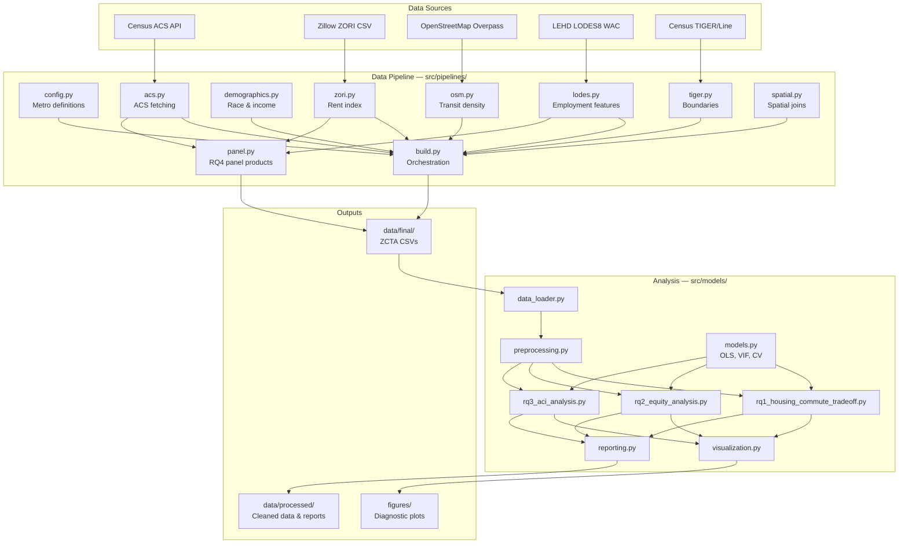
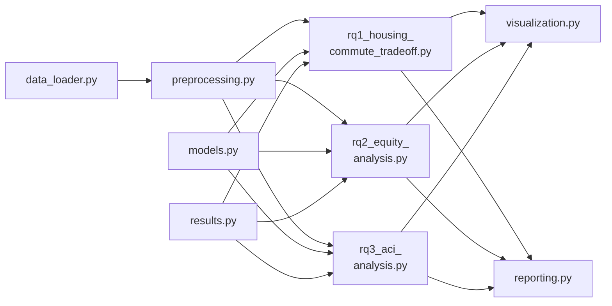
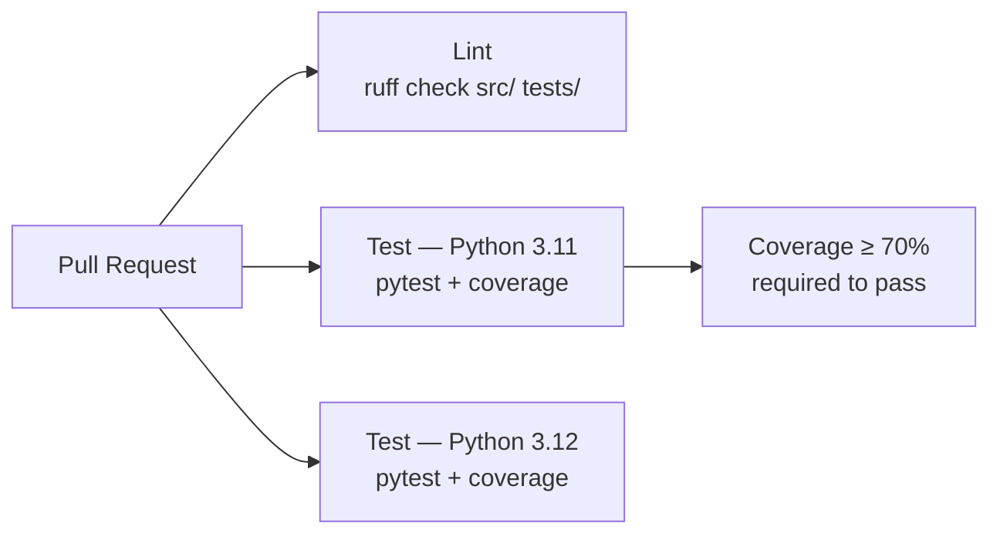

# Housing Affordability & Commute Trade-Off Analysis

      

A **data engineering and statistical analysis pipeline** that quantifies the relationship between housing costs, commute time, and public transit accessibility across nine U.S. metropolitan areas. Ingests data from Census ACS, Zillow, and OpenStreetMap, then applies OLS regression, equity analysis, and a composite Affordability-Commute Index (ACI) to identify affordability zones and inform policy decisions.

---

## Table of Contents

- [Overview](#overview)
  - [Research Questions](#research-questions)
  - [Data Sources](#data-sources)
- [Architecture](#architecture)
  - [High-Level Architecture](#high-level-architecture)
  - [Folder Structure](#folder-structure)
  - [Data Pipeline Flow](#data-pipeline-flow)
  - [Analysis Module Dependencies](#analysis-module-dependencies)
- [Getting Started](#getting-started)
  - [Prerequisites](#prerequisites)
  - [Installation](#installation)
  - [Running Tests](#running-tests)
- [Environment Variables](#environment-variables)
- [Usage](#usage)
  - [Running the Data Pipeline](#running-the-data-pipeline)
  - [Running the Analysis](#running-the-analysis)
  - [Reproducibility](#reproducibility)
- [Available Metro Areas](#available-metro-areas)
- [Pipeline Output Schema](#pipeline-output-schema)
  - [Panel Data Products (RQ4)](#panel-data-products-rq4)
- [Analysis Output](#analysis-output)
  - [RQ1: Housing-Commute Trade-Off](#rq1-housing-commute-trade-off)
  - [RQ2: Equity Analysis](#rq2-equity-analysis)
  - [RQ3: Affordability-Commute Index](#rq3-affordability-commute-index)
- [Continuous Integration](#continuous-integration)
- [Troubleshooting](#troubleshooting)
- [Contact](#contact)

---

## Overview

This project investigates how commute distance and transit access influence housing affordability at the **ZCTA (ZIP Code Tabulation Area)** level. It combines a reproducible data pipeline with rigorous statistical analysis to answer four research questions across nine metro areas.

### Research Questions

1. **RQ1 — Housing-Commute Trade-Off:** How does average commute time influence housing affordability (rent-to-income ratio)? Uses OLS regression with linear and quadratic specifications, selecting the best model via AIC.
2. **RQ2 — Equity Analysis:** How do housing and commute burdens vary by income segment and race? Uses interaction models, ANOVA tests, and K-Means clustering to identify inequities.
3. **RQ3 — Affordability-Commute Index (ACI):** Can a composite index of standardized rent burden and commute time identify the most burdened areas? Uses OLS and quantile regression with optional choropleth mapping.
4. **RQ4 — COVID and the Commute Gradient (ZORI Dynamics):** Did COVID reprice the commute gradient? Uses per-metro two-way fixed-effects estimation (ZCTA + sample-month) on the monthly ZORI panel, interacting pre-COVID (2019-vintage) gradient measures with a two-phase 2020 structural break, plus event-study and time-varying-accessibility specs. Built on the [panel data products](#panel-data-products-rq4).

### Data Sources

| Source | Data | Granularity |
|--------|------|-------------|
| **Census ACS 5-Year** | Commute patterns, rent, income, demographics, vehicle access | Census tract → ZCTA |
| **Census ACS 5-Year 2015–2019** | Pre-COVID commute-time vintage (B08303) for the RQ4 interaction regressors | ZCTA |
| **Zillow ZORI** | Observed Rent Index by ZIP code (latest month; smoothed, seasonally-adjusted series) | ZIP code |
| **Zillow ZORI panel** | Full monthly rent-index history 2015-01 onward from the smoothed **non-seasonally-adjusted** (`sm_month`) series; committed via snapshot-replace, with a gate that bounds and reports Zillow's between-pull revisions | ZIP-month |
| **OpenStreetMap** | Public transit stop locations (bus, rail, platform) | Point → ZCTA density |
| **LEHD LODES8 (WAC 2021 cross-section; WAC 2015–2023 panel)** | ZCTA job density, CBD distance, gravity job accessibility; annual job-count/accessibility panel for RQ4 | Census block → ZCTA/tract |
| **Census TIGER/Line** | CBSA boundaries, ZCTA & tract geometries | Geographic polygons |

---

## Architecture

### High-Level Architecture



### Folder Structure

```
housing-commute-analysis/
├── run_pipeline.py              # Data pipeline CLI entry point
├── run_analysis.py              # Analysis CLI entry point
├── pyproject.toml               # Project config, dependencies, tool settings
├── .env.example                 # Environment variable template
├── RUNNING_PIPELINE.md          # Detailed pipeline documentation
├── RUNNING_ANALYSIS.md          # Detailed analysis documentation
├── data/
│   ├── raw/                     # Raw downloaded data & shapefiles
│   │   └── shapefiles/          # ZCTA shapefiles for choropleth mapping
│   ├── final/                   # Pipeline output: one CSV per metro area
│   ├── processed/               # Analysis output: cleaned data & reports per metro
│   │   ├── ATL/                 # cleaned_data, rq1/rq3 model data, summary markdown
│   │   ├── CHI/
│   │   ├── DEN/
│   │   ├── DFW/
│   │   ├── LA/
│   │   ├── MEM/
│   │   ├── MIA/
│   │   ├── PHX/
│   │   └── SEA/
│   └── models/                  # Trained ML model artifacts
├── figures/                     # Diagnostic plots organized by metro
│   ├── ATL/
│   ├── CHI/
│   └── ...                      # One folder per metro
├── src/
│   ├── pipelines/               # ETL pipeline modules
│   │   ├── config.py            # Metro definitions, API keys, constants
│   │   ├── build.py             # Main pipeline orchestration
│   │   ├── acs.py               # Census ACS data fetching & feature computation
│   │   ├── demographics.py      # Race/ethnicity and income processing
│   │   ├── tiger.py             # TIGER/Line boundary downloads
│   │   ├── zori.py              # Zillow Observed Rent Index ingestion
│   │   ├── osm.py               # OpenStreetMap transit stop density
│   │   ├── lodes.py             # LEHD LODES employment features
│   │   ├── panel.py             # RQ4 panel data products (build_panel_flow)
│   │   ├── spatial.py           # Spatial joins & ZCTA filtering
│   │   └── utils.py             # HTTP retry utilities
│   ├── models/                  # Statistical analysis modules
│   │   ├── data_loader.py       # Data loading & validation (Polars)
│   │   ├── preprocessing.py     # Z-scores, feature engineering, income segments
│   │   ├── models.py            # OLS regression, VIF, cross-validation, ANOVA
│   │   ├── results.py           # Typed dataclass containers for RQ results
│   │   ├── rq1_housing_commute_tradeoff.py  # RQ1: rent ~ commute regression
│   │   ├── rq2_equity_analysis.py           # RQ2: equity & clustering
│   │   ├── rq3_aci_analysis.py              # RQ3: ACI index & quantile regression
│   │   ├── visualization.py     # Matplotlib diagnostic plots
│   │   └── reporting.py         # Markdown table & summary generation
│   └── dashboard/               # Interactive dashboard (WIP)
└── tests/                       # pytest unit tests
    ├── conftest.py              # Shared fixtures (sample DataFrames, numpy arrays)
    ├── test_models.py           # OLS, VIF, CV-RMSE tests
    ├── test_preprocessing.py    # Z-score, income segment tests
    ├── test_data_loader.py      # Load & validation tests
    ├── test_demographics.py     # Demographic computation tests
    ├── test_config.py           # Pipeline config tests
    ├── test_acs.py              # ACS feature computation tests
    ├── test_utils.py            # HTTP utility tests
    ├── test_reporting.py        # Markdown output tests
    └── fixtures/                # Test fixture data files
```

### Data Pipeline Flow

```mermaid
flowchart LR
    A["1. Fetch CBSA<br/>Boundary"] --> B["2. Load ZCTA &<br/>Tract Geometries"]
    B --> C["3. Fetch ACS<br/>Commute Data"]
    C --> D["4. Fetch ACS<br/>Demographics"]
    D --> E["5. Map Tracts<br/>to ZCTAs"]
    E --> F["6. Aggregate<br/>to ZCTA Level"]
    F --> G["7. Fetch Zillow<br/>ZORI Data"]
    G --> H["8. Compute Transit<br/>Stop Density"]
    H --> L["9. LODES Employment<br/>Features"]
    L --> I["Final ZCTA<br/>Dataset CSV"]
```



### Analysis Module Dependencies



---

## Getting Started

### Prerequisites

- **Python 3.11+**
- **uv** package manager ([install guide](https://docs.astral.sh/uv/getting-started/installation/))
- **Census API Key** (free) — [sign up here](https://api.census.gov/data/key_signup.html)
- **Git**

### Installation

```bash
# 1. Clone the repository
git clone https://github.com/cdcoonce/housing-commute-analysis.git
cd housing-commute-analysis

# 2. Install dependencies with uv
uv sync

# 3. Set up environment variables
cp .env.example .env
# Edit .env and add your Census API key
```

### Running Tests

```bash
# Run full test suite
uv run pytest

# Run with coverage
uv run pytest --cov=src --cov-report=term-missing

# Skip slow or network-dependent tests
uv run pytest -m "not slow and not network"
```

---

## Environment Variables

| Variable | Required | Description |
|----------|----------|-------------|
| `CENSUS_API_KEY` | Yes | Census Bureau API key for ACS data retrieval. [Get one free](https://api.census.gov/data/key_signup.html). |
| `METRO` | No | Metro area key for pipeline runs (default: `phoenix`). See [Available Metro Areas](#available-metro-areas). |
| `N_CLUSTERS` | No | Number of K-Means clusters for RQ2 equity analysis (default: `4`). |
| `RANDOM_STATE` | No | Random seed for reproducibility (default: `42`). |
| `DASHBOARD_PORT` | No | Port for the Dash dashboard (default: `8050`). |
| `DASHBOARD_DEBUG` | No | Enable Dash debug mode (default: `True`). |

---

## Usage

### Running the Data Pipeline

The pipeline fetches data from Census ACS, Zillow, and OpenStreetMap, then aggregates it into ZCTA-level CSV datasets.

```bash
# Run pipeline for default metro (Phoenix)
uv run python run_pipeline.py

# Run for a specific metro
METRO=atlanta uv run python run_pipeline.py

# Run for all nine metros sequentially
uv run python run_pipeline.py --all

# Build the RQ4 panel data products (requires the metro's 35-column dataset)
uv run python run_pipeline.py --panel
uv run python run_pipeline.py --panel --all   # all nine metros (= make panel)
```

**Processing time:** ~5–15 minutes per metro area.

Pipeline output is saved to `data/final/final_zcta_dataset_{metro}.csv`. The `--panel` mode instead writes the three [RQ4 panel data products](#panel-data-products-rq4) per metro.

For detailed pipeline documentation, see [RUNNING_PIPELINE.md](RUNNING_PIPELINE.md).

### Running the Analysis

After pipeline data is available, run the statistical analysis:

```bash
# Run analysis for a single metro
uv run python run_analysis.py --metro PHX --raw-dir data/final --out-dir data/processed --fig-dir figures

# Run analysis for all metros
uv run python run_analysis.py --all

# Equivalent shortcut
make analyze
```

**CLI Options:**

| Flag | Description | Default |
|------|-------------|---------|
| `--metro` | Metro code (**required**): PHX, LA, DFW, MEM, DEN, ATL, CHI, SEA, MIA | — |
| `--raw-dir` | Directory containing pipeline output CSVs | `data/final` |
| `--out-dir` | Output directory for processed data and reports | `data/processed` |
| `--fig-dir` | Output directory for figures | `figures` |
| `--zcta-shp` | Path to ZCTA shapefile for choropleth maps (optional) | Auto-detected |

For detailed analysis documentation, see [RUNNING_ANALYSIS.md](RUNNING_ANALYSIS.md).

### Reproducibility

```bash
# One command: install deps, build all nine metro datasets, run all analyses
make all
```

- Every pipeline run writes a **provenance manifest** alongside its dataset — `data/final/*.manifest.json` — recording a sha256 checksum, source vintages, and the output schema.
- `make verify-data` (`uv run python run_pipeline.py --verify`) re-checks every manifest offline against its CSV, with no network access. This is the same check CI runs on every pull request.
- The pipeline is a Prefect flow with a **7-day result cache**: re-running `run_pipeline.py` (or `make pipeline`) resumes from cached steps instead of re-fetching data that hasn't gone stale, so repeated runs are fast and idempotent.

---

## Available Metro Areas

| Pipeline Key | Analysis Code | Metro Area |
|-------------|---------------|------------|
| `phoenix` | `PHX` | Phoenix-Mesa-Chandler, AZ |
| `memphis` | `MEM` | Memphis, TN-MS-AR |
| `los_angeles` | `LA` | Los Angeles-Long Beach-Anaheim, CA |
| `dallas` | `DFW` | Dallas-Fort Worth-Arlington, TX |
| `denver` | `DEN` | Denver-Aurora-Lakewood, CO |
| `atlanta` | `ATL` | Atlanta-Sandy Springs-Alpharetta, GA |
| `chicago` | `CHI` | Chicago-Naperville-Elgin, IL-IN-WI |
| `seattle` | `SEA` | Seattle-Tacoma-Bellevue, WA |
| `miami` | `MIA` | Miami-Fort Lauderdale-Pompano Beach, FL |

---

## Pipeline Output Schema

Each final ZCTA CSV contains 35 columns across six categories:

| Column | Description | Source |
|--------|-------------|--------|
| **Housing** | | |
| `rent_to_income` | Median gross rent / median income | ACS B25064, B19013 |
| `pct_rent_burden_30` | % paying 30%+ income on rent | ACS (derived) |
| `pct_rent_burden_50` | % paying 50%+ income on rent | ACS (derived) |
| `zori` | Zillow Observed Rent Index ($) | Zillow ZORI |
| `renter_share` | % renter-occupied housing units | ACS B25003 |
| **Commute** | | |
| `commute_min_proxy` | Weighted average commute time (min) | ACS B08303 |
| `pct_commute_lt10` – `pct_commute_60_plus` | Commute time distribution bins | ACS B08303 |
| `pct_drive_alone`, `pct_carpool`, `pct_car` | Driving mode shares | ACS B08301 |
| `pct_transit`, `pct_walk`, `pct_wfh` | Alternative mode shares | ACS B08301 |
| **Transit** | | |
| `stops_per_km2` | Transit stops per km² | OpenStreetMap |
| **Employment** | | |
| `job_density` | Jobs per km² (LODES WAC C000 / ZCTA UTM area) | LEHD LODES |
| `distance_to_cbd_km` | Km from ZCTA centroid to nearest metro CBD point (dual-CBD for DFW) | Derived (config CBD points) |
| `job_accessibility` | Gravity index: Σ jobs·exp(−d/10 km) over metro tracts | LEHD LODES + TIGER |
| **Demographics** | | |
| `total_pop`, `pop_density` | Population and density (per km²) | ACS B01001 |
| `pct_white`, `pct_black`, `pct_asian`, `pct_hispanic`, `pct_other` | Race/ethnicity | ACS B03002 |
| `median_income` | Median household income ($) | ACS B19013 |
| `income_segment` | Income tercile (low/medium/high) | Derived |
| **Vehicle** | | |
| `vehicle_access` | % households with 1+ vehicles | ACS B08201 |

### Panel Data Products (RQ4)

`run_pipeline.py --panel` (or `make panel` for all metros) builds three additional committed files per metro in `data/final/`, scoped to the ZCTAs of the metro's committed 35-column dataset and joined to it at analysis time. Across the nine metros:

| File | Columns | Coverage | Gate semantics (`scripts/panel_gate.py`) |
|------|---------|----------|------------------------------------------|
| `zori_panel_<metro>.csv` | `ZCTA5CE`, `period`, `zori` | Monthly, 2015-01 onward (committed vintage: through 2026-06, 138 months); ~102.8k rows total | **Snapshot-replace:** each rebuild replaces the panel wholesale with one coherent Zillow vintage; the gate bounds and reports between-pull revisions |
| `lodes_panel_<metro>.csv` | `ZCTA5CE`, `year`, `job_count`, `job_accessibility` | Annual, 2015–2023, full ZCTA × year grid; 13,527 rows total | **Append-only:** `job_count` byte-identical on existing cells, `job_accessibility` within float-noise tolerance; new years append at the tail |
| `acs_commute_2019_<metro>.csv` | `ZCTA5CE`, `commute_min_proxy_2019`, `ttw_total_2019` | One row per ZCTA in the frozen ACS 2015–2019 release; 1,490 rows total | **Frozen vintage:** byte-identical / float-noise only, no escape hatch |

The ZORI panel is built from Zillow's smoothed **non-seasonally-adjusted** ZIP series (`Zip_zori_uc_sfrcondomfr_sm_month.csv`, `ZORI_PANEL_CSV_URL` in `src/pipelines/config.py`) — not the seasonally-adjusted file the cross-sectional `zori` column uses — because Zillow re-estimates SA factors over the full sample each release, which would leak post-2020 data into pre-2020 values. Each CSV is paired with a provenance manifest (`<metro>.zori_panel.manifest.json`, etc.) checked by `run_pipeline.py --verify`. See [RUNNING_PIPELINE.md](RUNNING_PIPELINE.md) for per-metro row counts and the gate procedure.

---

## Analysis Output

For each metro area, the analysis generates:

### RQ1: Housing-Commute Trade-Off

- **Methodology:** OLS regression with HC3 robust standard errors, comparing linear vs. quadratic specifications. Model selected by AIC; validated with 3-fold CV-RMSE and VIF diagnostics.
- **Outputs:**
  - `data/processed/{METRO}/rq1_model_data_{metro}.csv` — model input data
  - `figures/{METRO}/rq1_{metro}_*.png` — four diagnostic plots (residuals, Q-Q, predicted vs. actual, partial regression)

### RQ2: Equity Analysis

- **Methodology:** Interaction models (income × commute), ANOVA by income segment and race, K-Means clustering on rent burden and commute time.
- **Outputs:**
  - Group comparison statistics and ANOVA results
  - Cluster assignments and equity visualizations

### RQ3: Affordability-Commute Index

- **Methodology:** Composite ACI = z(rent_to_income) + z(commute_min_proxy). Modeled with OLS and quantile regression (25th, 50th, 75th percentiles). Optional choropleth mapping.
- **Outputs:**
  - `data/processed/{METRO}/rq3_aci_data_{metro}.csv` — ACI scores per ZCTA
  - Tier summary and quantile regression coefficients

**Summary report:** `data/processed/{METRO}/analysis_summary_{metro}.md`

---

## Continuous Integration

Every pull request to `main` runs a GitHub Actions pipeline with two jobs:



| Job | What it does |
|-----|-------------|
| **Lint** | Runs `ruff check` on all source and test files |
| **Test (3.11, 3.12)** | Runs `pytest -m "not network"` with coverage. Fails if testable-module coverage drops below 70%. |

Network-dependent tests (Census API, OpenStreetMap) are skipped in CI — no secrets required.

Workflow file: [`.github/workflows/ci.yml`](.github/workflows/ci.yml)

---

## Troubleshooting

| Symptom | Likely Cause | Fix |
|---------|-------------|-----|
| Census API rate limit errors | Missing or invalid API key | Get a free key at [census.gov](https://api.census.gov/data/key_signup.html). Add to `.env` as `CENSUS_API_KEY=your_key`. |
| `ModuleNotFoundError` or import errors | Not running from project root, or deps not installed | Run `uv sync` from repo root. Use `uv run` prefix on all commands. |
| `FileNotFoundError` on analysis CSVs | Pipeline hasn't been run for that metro | Run `uv run python run_pipeline.py` with the appropriate `METRO` env var first. |
| OSMnx / Overpass timeout | OpenStreetMap API rate limits or downtime | Retry after a few minutes. The pipeline caches results in `.cache/`. |
| `.cache/` folder appearing | Normal OSMnx caching behavior | Ignored by git. Safe to delete to force re-download. |
| Missing columns in final CSV | Incomplete pipeline run or API errors | Re-run the pipeline for the affected metro. Check logs for step-level failures. |

---

## Contact

For questions or support, contact:

- **Charles Coonce** — charlescoonce@gmail.com | [github.com/cdcoonce](https://github.com/cdcoonce)